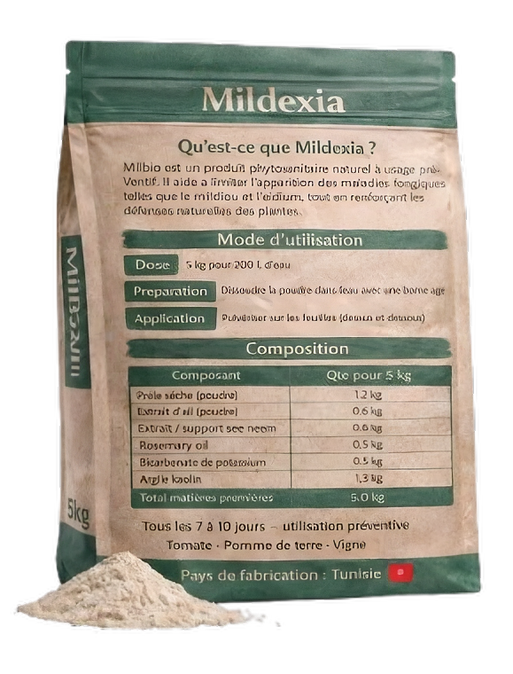

<div align="center">
  
  
  # 🌿 Mildexia
  ### Preventive Phytosanitary Shield Against Downy Mildew
  
  **Protects Your Crops. Respects the Environment.**
  
  [Live Application](https://mildexia.vercel.app)
</div>

---

## 📖 About The Project

**Mildexia** is a revolutionary phytosanitary product designed to act as a preventive shield against fungal diseases like **Downy Mildew** and **Powdery Mildew**. 

Formulated with a unique blend of **plant extracts** and **mineral-based ingredients**, Mildexia strengthens the natural defense mechanisms of your crops while ensuring zero chemical residue. It is the perfect ally for sustainable and responsible agriculture. 🌍

### ✨ Key Features

*   🛡️ **Preventive Action**: Stops diseases before they start.
*   🌱 **100% Natural Formulation**: Based on Horsetail, Garlic Extract, Neem Oil, and other natural ingredients.
*   🚜 **Target Crops**: Specifically effective for Tomatoes 🍅, Potatoes 🥔, and Vines 🍇.
*   ♻️ **Eco-Friendly**: No persistent chemical residues, safe for the soil and the farmer.
*   🇹🇳 **Made in Tunisia**: Locally developed and produced.

---

## 📸 Product Showcase

<div align="center">
  <table>
    <tr>
      <td align="center">
        
        <br />
        <b>Front Packaging</b>
      </td>
      <td align="center">
        
        <br />
        <b>Back Packaging (Instructions)</b>
      </td>
    </tr>
  </table>
</div>

---

## 📦 Usage Instructions

1.  **Dosage**: Dissolve **5 kg** of Mildexia powder in **200 L** of water.
2.  **Preparation**: Mix thoroughly until completely dissolved.
3.  **Application**: Spray evenly on crop leaves, covering both upper and lower surfaces.

---
## 💻 Technical Stack

This landing page was built with modern web technologies to ensure a fast, responsive, and beautiful user experience.

*   ⚛️ **React 19** - UI Library
*   ⚡ **Vite** - Next Generation Frontend Tooling
*   🎨 **Tailwind CSS** - Utility-first CSS Framework
*   🎭 **Framer Motion** - Production-ready animations
*   ☁️ **Vercel Blob** - For storing newsletter subscriptions

---

## 🚀 Getting Started

Follow these steps to set up the project locally on your machine.

### Prerequisites

*   **Node.js** (v18 or higher)
*   **npm** or **yarn**

### Installation

1.  **Clone the repository**
    ```sh
    git clone https://github.com/your-username/mildexia.git
    cd mildexia
    ```

2.  **Install dependencies**
    ```sh
    npm install
    ```

3.  **Set up Environment Variables**
    Create a `.env.local` file for Vercel Blob storage (newsletter feature):
    ```env
    BLOB_READ_WRITE_TOKEN=your_vercel_blob_token
    ```

4.  **Run the local server**
    To run the app with API support (for the newsletter):
    ```sh
    npx vercel dev
    ```
    Or for frontend only:
    ```sh
    npm run dev
    ```

---

<div align="center">
  <p>Made with ❤️ for a Greener Future.</p>
  <p>© 2026 Mildexia. All Rights Reserved.</p>
</div>
